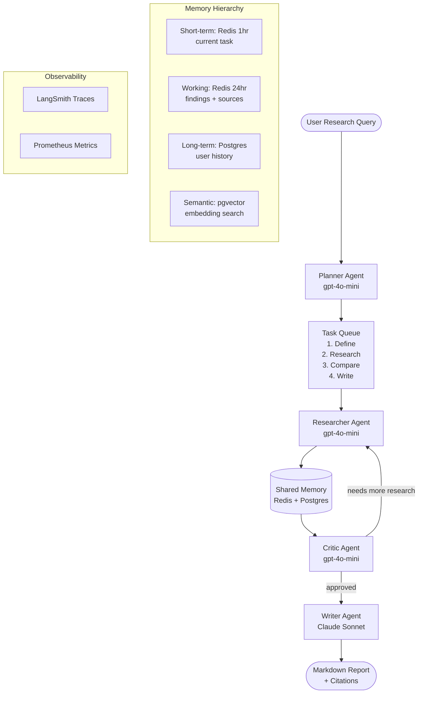

# Multi-Agent Research Assistant

A production-grade research assistant where four specialized AI agents collaborate like a team: **Planner** decomposes tasks, **Researcher** gathers information, **Critic** enforces quality, and **Writer** synthesizes the final report. Coordination is handled by a deterministic LangGraph state machine — no autonomous chaos.

---

## Architecture



### Agent Roles

| Agent | Model | Responsibility |
|-------|-------|---------------|
| **Planner** | GPT-4o-mini | Breaks query into ordered subtasks, delegates |
| **Researcher** | GPT-4o-mini | Web search, doc retrieval, fact extraction, citation |
| **Critic** | GPT-4o-mini | Reviews findings, checks citations, flags gaps |
| **Writer** | Claude Sonnet 4.6 | Synthesizes coherent, cited markdown report |

---

## Tech Stack

| Component | Technology |
|-----------|-----------|
| Agent Orchestration | LangGraph |
| Short-term Memory | Redis (1hr / 24hr TTL) |
| Long-term Memory | PostgreSQL |
| Semantic Memory | pgvector |
| Web Search | Tavily API |
| Article Extraction | BeautifulSoup4 |
| Message Typing | Pydantic v2 |
| Tracing | LangSmith |
| Metrics | Prometheus |
| API | FastAPI |

---

## Project Structure

```
multi-agent-research/
├── src/
│   ├── agents/
│   │   ├── base.py           # Abstract base with retry + logging
│   │   ├── planner.py        # Task decomposition agent
│   │   ├── researcher.py     # Information gathering agent
│   │   ├── critic.py         # Quality evaluation agent
│   │   └── writer.py         # Report synthesis agent
│   ├── orchestration/
│   │   ├── graph.py          # LangGraph workflow
│   │   ├── state.py          # Shared state schema
│   │   └── messages.py       # Pydantic message types
│   ├── memory/
│   │   ├── redis_client.py   # Short/working term memory
│   │   ├── postgres_client.py # Long-term + session storage
│   │   └── semantic.py       # pgvector search
│   ├── tools/
│   │   ├── search.py         # Tavily web search
│   │   ├── scraper.py        # URL content extraction
│   │   └── validator.py      # Fact / source validation
│   ├── api/
│   │   └── main.py           # FastAPI endpoints
│   └── config.py
├── tests/
│   ├── test_agents.py
│   └── test_orchestration.py
├── deployment/
│   ├── docker-compose.yml
│   └── Dockerfile
├── docs/
│   └── architecture.md
├── pyproject.toml
└── .env.example
```

---

## Quick Start

### Prerequisites
- Docker & Docker Compose
- Python 3.11+
- [uv](https://docs.astral.sh/uv/)

### 1. Clone and configure

```bash
git clone <repo>
cd multi-agent-research
cp .env.example .env
# Fill OPENAI_API_KEY, ANTHROPIC_API_KEY, TAVILY_API_KEY
```

### 2. Start infrastructure

```bash
docker-compose -f deployment/docker-compose.yml up -d
```

Starts: PostgreSQL (`:5432`), Redis (`:6379`), and the app (`:8001`).

### 3. Install and run

```bash
uv venv && source .venv/bin/activate
uv pip install -e ".[dev]"
uvicorn src.api.main:app --reload --port 8001
```

### 4. Run a research task

```bash
curl -X POST http://localhost:8001/research \
  -H "Content-Type: application/json" \
  -d '{"query": "Compare RAG vs fine-tuning for production LLM systems"}'
```

---

## API Reference

### `POST /research`

```json
{
  "query": "string",
  "max_subtasks": 5,
  "session_id": "optional-uuid"
}
```

**Response:**
```json
{
  "report": "# Markdown report...",
  "sources": ["https://..."],
  "plan": ["subtask 1", "subtask 2"],
  "critic_iterations": 1,
  "session_id": "uuid",
  "latency_ms": 18500
}
```

### `GET /sessions/{session_id}`

Retrieve a past research session with full agent history.

### `GET /health`

```json
{"status": "ok", "redis": "up", "postgres": "up"}
```

---

## Observability

- **LangSmith**: Every agent decision is traced with inputs, outputs, and timing
- **Prometheus** at `:9091/metrics`: agent latency, critic retry count, token usage
- **Structured logs** via `structlog`: JSON output, correlate by `session_id`

---

## Memory Architecture

```
Short-term  (Redis, 1hr)   → current task context, active subtask
Working     (Redis, 24hr)  → all facts, sources, criticisms for this session
Long-term   (Postgres)     → user preferences, past research topics, summaries
Semantic    (pgvector)     → vector search across all stored facts
```

Agents write to and read from shared memory rather than passing all data through messages — the Writer doesn't receive 50 source URLs, it reads from memory when synthesizing.

---

## Performance

| Metric | Value |
|--------|-------|
| Avg research latency | ~25–45s (3 subtasks) |
| Critic retry rate | ~30% of sessions |
| Memory lookups (semantic) | P50 < 80ms |
| Token cost per research | ~$0.05–0.15 |

---

## One-Command Deploy

```bash
docker-compose -f deployment/docker-compose.yml up --build
```

---

## License

MIT
